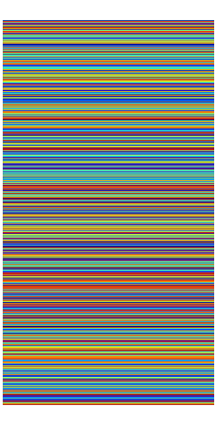

# Life lines
Create a plot where each line represents a day in the life of a human:
The amount of days is configurable. A 80 year old human experiences 80 * 365 days = 29200 days.

`python plot.py`

Output looks like this:

